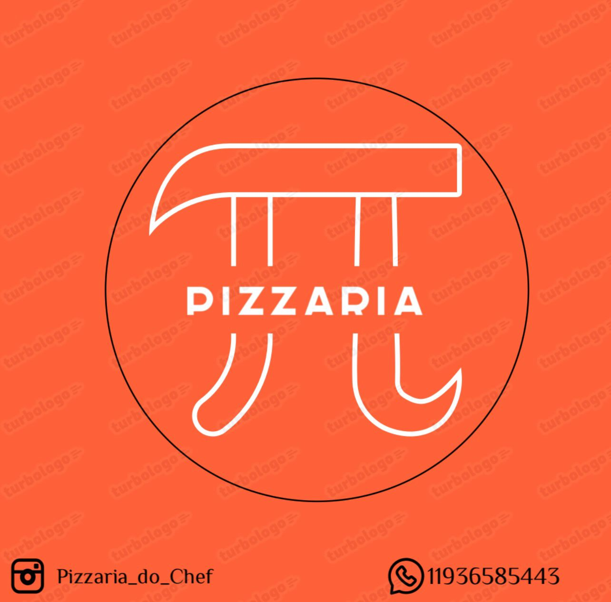

<div align="center">
  <h1>🍕 Pizzaria TT — Sistema Full Stack</h1>
  
  <br/><br/>
  
  
  
  
</div>

---

## Sobre o Projeto

A **Pizzaria TT** é um sistema Full Stack acadêmico desenvolvido como **Projeto de Extensão**. Permite que clientes façam pedidos via cardápio digital interativo, e que a equipe da pizzaria gerencie os pedidos e o cardápio em tempo real por um painel administrativo.

**Back-end:** PHP 8 procedural + PDO + MySQL (XAMPP)  
**Front-end:** HTML5 + Tailwind CSS 3 + JavaScript ES6+ (sem framework)  
**Banco de dados:** MySQL via phpMyAdmin

---

## Equipe

| Aluno | RA | Função | Responsabilidade |
|---|---|---|---|
| **Eduardo Daniel Alves Sampaio** | 2224104694 | Líder Técnico / Back-end | APIs PHP, painel admin, configuração do banco, integração front-back |
| **Eduardo Matheus Correia Santos** | 2224107415 | Líder Front-end | index.php, script.js, Tailwind CSS, visual, UX/UI |
| **Diogo Neves** | 2224102999  | Front-end (suporte) | Organização da documentação |
| **João Paulo Nunes de Jesus Araujo Leitão** | 2224107083 | Banco de Dados | Modelagem, script SQL, seeds de teste, diagrama ER |

---

## Funcionalidades

### Para o cliente
- Cardápio digital com pizzas e bebidas carregadas em tempo real da API
- Seleção de tamanho (P / M / G) com atualização automática de preço
- Carrinho de compras com controle de quantidade
- Checkout com validação de formulário (nome, CPF, telefone, endereço, pagamento)
- Número de pedido gerado automaticamente (ex: `TT-20260604-0001`)
- Efeito de brilho dourado nas imagens das pizzas ao passar o mouse

### Para o administrador
- Painel de pedidos do dia com filtro por status
- Atualização de status em tempo real via AJAX (sem recarregar a página)
- **Gerenciamento do cardápio**: adicionar novas pizzas/bebidas com upload de imagem
- **Desativar/Reativar** itens do cardápio sem apagar o histórico de pedidos
- Auto-refresh do painel a cada 60 segundos

---

## Instalação no XAMPP (passo a passo)

### Pré-requisitos
- [XAMPP](https://www.apachefriends.org/) instalado com **Apache** e **MySQL** iniciados
- Projeto em `c:\xampp\htdocs\pizzaria\Pizzaria-main\`

---

### Passo 1 — Importar o banco de dados

1. Abra `http://localhost/phpmyadmin`
2. Clique em **Importar** → **Escolher arquivo**
3. Selecione o arquivo:
   ```
   Pizzaria-main/Banco de dados/pizzaria_tt.sql
   ```
4. Clique em **Executar**
5. O banco `pizzaria_tt` será criado com todas as tabelas e 22 itens do cardápio

---

### Passo 2 — Usuário administrador

O usuário admin **já está incluído no arquivo SQL**, criado automaticamente ao importar o banco. Não é necessário rodar nenhum script adicional.

| Campo | Valor padrão |
|---|---|
| Usuário | `admin` |
| Senha | `admin123` |

> 💡 Caso queira redefinir a senha futuramente, acesse `admin/setup.php` — ele recria o hash bcrypt com a senha que você definir.

---

### Passo 3 — Acessar o sistema

| Página | URL |
|---|---|
| 🍕 Cardápio do cliente | `http://localhost/pizzaria/Pizzaria-main/` |
| 🔧 Painel de pedidos | `http://localhost/pizzaria/Pizzaria-main/admin/` |
| 🍕 Gerenciar cardápio | `http://localhost/pizzaria/Pizzaria-main/admin/cardapio.php` |
| 📊 API — cardápio JSON | `http://localhost/pizzaria/Pizzaria-main/api/pizzas.php` |
| 📦 API — status pedido | `http://localhost/pizzaria/Pizzaria-main/api/status.php?numero=TT-AAAAMMDD-0001` |

---

### (Opcional) Passo 4 — Recompilar o Tailwind CSS

Necessário apenas se editar `styles/style.css`. Requer Node.js instalado.

```bash
npm install
npm run dev
```

---

## Estrutura de Pastas

```
Pizzaria-main/
│
├── index.php                     # Página principal — banner, cardápio e checkout
│                                 # [Eduardo Matheus RA: 2224107415]
│
├── js/
│   └── script.js                 # Carrinho, fetch API, validações, eventos
│                                 # [Eduardo Matheus RA: 2224107415]
│
├── styles/
│   ├── style.css                 # CSS fonte — paleta, animações, layout
│   │                             # [Eduardo Matheus RA: 2224107415]
│   └── output.css                # CSS compilado pelo Tailwind (não editar)
│
├── tailwind.config.js            # Configuração do Tailwind CSS
├── package.json                  # Dependências npm
│
├── assets/                       # Imagens do cardápio, logo e banners
│   ├── bannerc.png               # Banner principal do topo do site
│   ├── Logo_Pizzaria.jpg         # Logo da pizzaria
│   └── *.png                     # Fotos das pizzas e bebidas
│                                 # [Diogo Neves / Eduardo Matheus RA: 2224107415]
│
├── config/
│   └── db.php                    # Conexão PDO com MySQL (singleton)
│                                 # [Eduardo Daniel RA: 2224104694]
│
├── api/
│   ├── pizzas.php                # GET  — retorna cardápio em JSON
│   ├── pedido.php                # POST — registra novo pedido
│   └── status.php                # GET  — consulta status de pedido
│                                 # [Eduardo Daniel RA: 2224104694]
│
├── admin/
│   ├── login.php                 # Autenticação do administrador
│   ├── logout.php                # Encerra sessão
│   ├── index.php                 # Painel de pedidos do dia + filtros
│   ├── cardapio.php              # Gerenciar cardápio (add/desativar itens)
│   ├── atualizar_status.php      # Endpoint AJAX para atualizar status de pedido
│   └── setup.php                 # ⚠️ Cria admin padrão — deletar após uso!
│                                 # [Eduardo Daniel RA: 2224104694]
│
└── Banco de dados/
    └── pizzaria_tt.sql           # Script completo: tabelas + dados do cardápio
                                  # [João Paulo Nunes RA: 2224107083]
```

---

## Como o sistema funciona

### Fluxo do cliente

```
1. Cliente acessa index.php
        ↓
2. JavaScript chama GET /api/pizzas.php
        ↓
3. Cards de pizza são gerados dinamicamente
        ↓
4. Cliente adiciona itens ao carrinho
        ↓
5. Cliente preenche o formulário de checkout
        ↓
6. JavaScript envia POST /api/pedido.php
        ↓
7. PHP valida, salva no banco e retorna número do pedido
        ↓
8. Cliente vê o número do pedido (ex: TT-20260604-0001)
```

### Fluxo do administrador

```
1. Admin acessa admin/login.php e faz login
        ↓
2. admin/index.php lista pedidos do dia (filtro por status)
        ↓
3. Admin clica em "Atualizar" para mudar o status do pedido
        ↓
4. AJAX envia para atualizar_status.php (sem recarregar a página)
        ↓
5. Badge do pedido atualiza em tempo real

— Aba separada —
6. Admin acessa admin/cardapio.php
        ↓
7. Preenche formulário com nome, descrição, preços e foto
        ↓
8. PHP faz upload da imagem para assets/ e insere no banco
        ↓
9. Item aparece automaticamente no cardápio do cliente
```

---

## Banco de Dados

**Nome:** `pizzaria_tt` | **Credenciais XAMPP:** `root` / *(sem senha)*

| Tabela | Descrição |
|---|---|
| `pizzas` | Cardápio completo — 20 pizzas + 2 bebidas, preços P/M/G, campo `ativa` para ocultar sem deletar |
| `clientes` | Dados do cliente coletados no checkout (nome, CPF, telefone, endereço) |
| `pedidos` | Registro de cada pedido com número legível, valor total e status rastreável |
| `itens_pedido` | Itens de cada pedido com preço no momento da venda (imune a mudanças futuras) |
| `usuarios_admin` | Logins do painel com senha em hash bcrypt |

---

## Endpoints da API

### `GET /api/pizzas.php`
```json
{
  "sucesso": true,
  "pizzas":  [{ "id": 1, "nome": "4 Queijos", "preco_p": 30.0, "preco_m": 35.0, "preco_g": 40.0 }],
  "bebidas": [{ "id": 21, "nome": "Coca-Cola 2L", "preco_m": 10.0 }]
}
```

### `POST /api/pedido.php`
```json
{
  "nome": "Maria Silva", "cpf": "12345678901", "telefone": "11987654321",
  "endereco": "Rua das Flores, 123", "pagamento": "Pix", "obs": "Sem cebola",
  "itens": [{ "pizza_id": 1, "tamanho": "M", "quantidade": 2, "preco_unitario": 35.00 }]
}
```
Resposta:
```json
{ "sucesso": true, "numero_pedido": "TT-20260604-0001", "valor_total": "70,00" }
```

### `GET /api/status.php?numero=TT-20260604-0001`
Retorna status atual e itens do pedido.

---

## Tecnologias

| Camada | Tecnologia |
|---|---|
| Front-end | HTML5, Tailwind CSS 3, JavaScript ES6+, Toastify JS, Font Awesome 6 |
| Back-end | PHP 8+ procedural, PDO com prepared statements |
| Servidor | Apache via XAMPP |
| Banco | MySQL via XAMPP + phpMyAdmin |
| Build | Node.js + Tailwind CLI |

---

## Credenciais Padrão

| Sistema | Usuário | Senha | Observação |
|---|---|---|---|
| Painel Admin | `admin` | `admin123` | Já criado no SQL — não precisa de setup |
| MySQL (XAMPP) | `root` | *(vazia)* | Padrão do XAMPP |

---

## Autores

| Aluno | RA | Contato |
|---|---|---|
| Eduardo Daniel Alves Sampaio | 2224104694 | Back-end & Integração |
| Eduardo Matheus Correia Santos | 2224107415 | Front-end & UI/UX |
| Diogo Neves | — | Front-end & Assets |
| João Paulo Nunes de Jesus Araujo Leitão | 2224107083 | Banco de Dados |

---

*Pizzaria TT &copy; 2026 — Projeto de Extensão Acadêmico*
